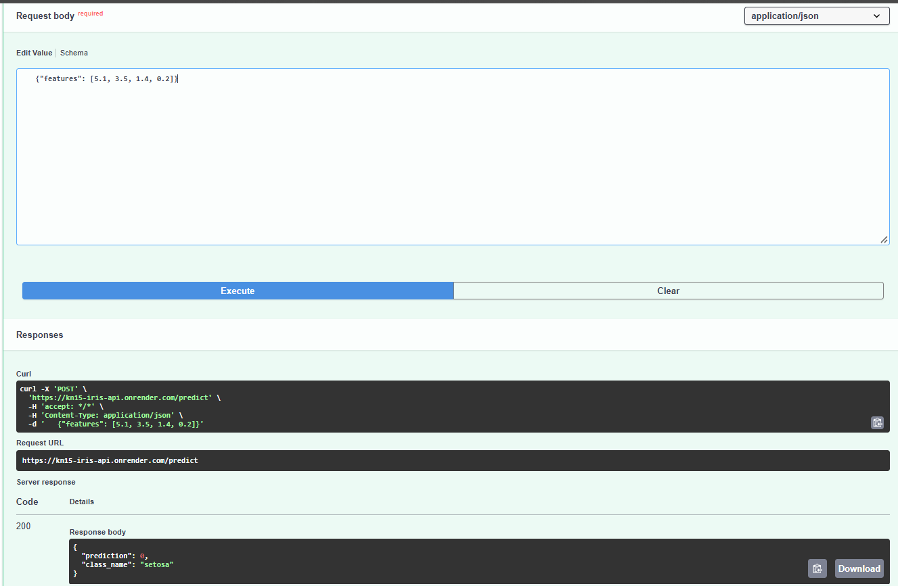
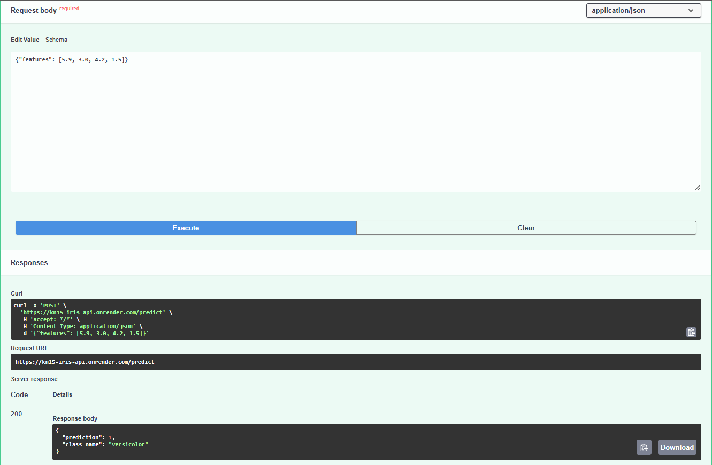
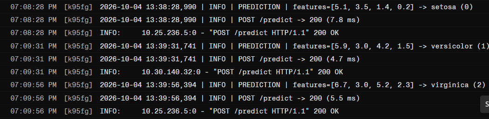

# ML in Production - Iris Classifier API

A FastAPI service that serves a scikit-learn model (Random Forest trained on the
Iris dataset), containerised with Docker, hosted on GitHub and deployed live on Render.

**Workflow:** Model -> FastAPI -> Docker -> GitHub -> Render -> Logging & Monitoring

## Live API

- Base URL: https://kn15-iris-api.onrender.com
- Interactive docs (Swagger UI): https://kn15-iris-api.onrender.com/docs
- Health check: https://kn15-iris-api.onrender.com/health
- GitHub repo: https://github.com/KN15-git/ML-production

> Hosted on Render's free tier, so the first request after a period of
> inactivity can take up to ~50 seconds while the service wakes up.

## Endpoints

| Method | Path       | Description                                    |
|--------|------------|------------------------------------------------|
| GET    | `/`        | Welcome message                                |
| GET    | `/health`  | Health check (also reports if model is loaded) |
| POST   | `/predict` | Predict the Iris species from 4 measurements   |

`features` = `[sepal_length, sepal_width, petal_length, petal_width]` (in cm).

### Example request

```bash
curl -X POST https://kn15-iris-api.onrender.com/predict \
     -H "Content-Type: application/json" \
     -d '{"features": [5.1, 3.5, 1.4, 0.2]}'
```

### Example response

```json
{"prediction": 0, "class_name": "setosa"}
```

## Testing the live API

I tested the deployed `/predict` endpoint with one sample from each Iris class.
All three returned HTTP `200` with the expected species.

| Input features       | Expected   | Result                         |
|----------------------|------------|--------------------------------|
| `[5.1, 3.5, 1.4, 0.2]` | setosa     | `prediction: 0`, `setosa` (200)     |
| `[5.9, 3.0, 4.2, 1.5]` | versicolor | `prediction: 1`, `versicolor` (200) |
| `[6.7, 3.0, 5.2, 2.3]` | virginica  | `prediction: 2`, `virginica` (200)  |

### Setosa


### Versicolor


### Virginica


## Logging & monitoring

The app logs to stdout, which Render shows in the **Logs** tab:

- model load status at startup
- every request: method, path, status code and latency (ms)
- every prediction: input features and predicted class
- errors (e.g. invalid input returns 422)

Application logs from the live Render service after the three test requests above:



## What the model predicts

The model is a Random Forest classifier trained on the Iris dataset. Given four
flower measurements (in cm), it predicts which of three Iris species the flower
is: `setosa` (0), `versicolor` (1) or `virginica` (2).

## Example request body for `/predict`

```json
{
  "features": [5.1, 3.5, 1.4, 0.2]
}
```

Order of values: `[sepal_length, sepal_width, petal_length, petal_width]`.
`features` must contain exactly 4 numbers.

## Run locally

```bash
git clone https://github.com/KN15-git/ML-production.git
cd ML-production
python -m venv venv
source venv/bin/activate        # Windows: venv\Scripts\activate
pip install -r requirements.txt
python train.py                 # (re)creates model.pkl
uvicorn main:app --reload       # http://127.0.0.1:8000/docs
```

## Run with Docker

```bash
docker build -t iris-api .
docker run -p 8000:8000 iris-api
```

## Deployment (Render)

1. Push this repo to GitHub.
2. On Render: **New +** -> **Web Service** -> connect the GitHub repo.
3. Runtime: **Docker**, branch `main`, instance type **Free**.
4. Render builds the `Dockerfile` and serves the app; it redeploys automatically on every push.

## Project structure

```
main.py            FastAPI app (endpoints + logging)
train.py           Trains the model and saves model.pkl
model.pkl          Trained Random Forest model
requirements.txt   Pinned dependencies
Dockerfile         Container definition
screenshots/       Live API test and log screenshots
```
